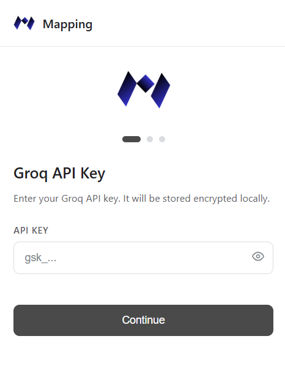
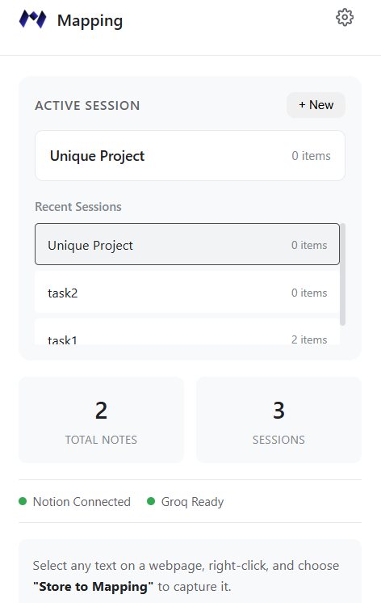
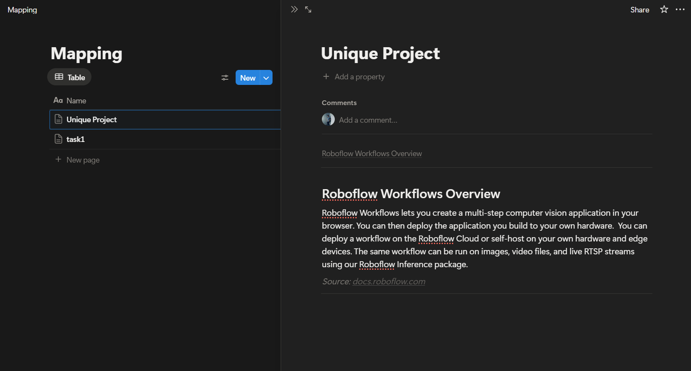

# Mapping

<p align="center">
  
</p>

<p align="center">
  <strong>A privacy-first browser extension for intelligent knowledge mapping</strong>
</p>

<p align="center">
  Capture text from anywhere on the web, intelligently structure and interconnect it using Groq AI, and store it directly into your Notion workspace as a continuously evolving knowledge map.
</p>

---

## System Demonstration

<!-- Add your demo video/gif here -->
<p align="center">
  
</p>

*Click the image above to watch the system demonstration*

## Screenshots

<table>
  <tr>
    <td></td>
    <td></td>
  </tr>
  <tr>
    <td align="center"><em>Onboarding Flow</em></td>
    <td align="center"><em>Dashboard View</em></td>
  </tr>
</table>

<table>
  <tr>
    <td></td>
    <td></td>
  </tr>
  <tr>
    <td align="center"><em>Right-Click Context Menu</em></td>
    <td align="center"><em>Generated Notion Page</em></td>
  </tr>
</table>

---

## Table of Contents

- [System Overview](#system-overview)
- [Architecture](#architecture)
- [Key Features](#key-features)
- [Technology Stack](#technology-stack)
- [Installation](#installation)
- [Configuration](#configuration)
- [Usage](#usage)
- [Security Model](#security-model)
- [API Integration](#api-integration)
- [Project Structure](#project-structure)
- [Troubleshooting](#troubleshooting)

---

## System Overview

Mapping represents a comprehensive solution for transforming scattered web content into structured, interconnected knowledge within your personal Notion workspace. The extension operates entirely client-side, ensuring that your data never passes through third-party servers beyond the essential API calls to Groq for AI processing and Notion for storage.

The system processes captured text through an intelligent pipeline that analyzes content, identifies relationships with previously captured knowledge, and organizes everything into clean, navigable Notion pages. Each session creates a single interconnected document where all captured content is appended with AI-detected connections, creating a living knowledge map that grows with each capture.

A key architectural principle is privacy by design. All credentials are encrypted locally using AES-256-GCM encryption with keys derived from your password through PBKDF2 with 100,000 iterations. No analytics, no tracking, no backend servers. Your knowledge remains yours.

The extension employs a session-based organization model where each session corresponds to a single Notion page. As you capture content throughout a research session, the AI identifies connections between new and existing content, building a comprehensive knowledge document with automatic table of contents and collapsible connection references.

---

## Architecture

The extension architecture implements a layered design that separates concerns across distinct processing stages. Each layer has well-defined responsibilities, enabling independent testing and optimization while maintaining end-to-end security.

```
┌─────────────────────────────────────────────────────────────┐
│                    BROWSER EXTENSION                        │
│  ┌──────────────┐  ┌──────────────┐  ┌──────────────┐      │
│  │   Popup UI   │  │   Content    │  │  Background  │      │
│  │  (Dashboard) │  │   Scripts    │  │   Worker     │      │
│  └──────────────┘  └──────────────┘  └──────────────┘      │
└─────────────────────────────────────────────────────────────┘
                            │
        ┌───────────────────┼───────────────────┐
        ▼                   ▼                   ▼
┌──────────────┐    ┌──────────────┐    ┌──────────────┐
│   Storage    │    │   Crypto     │    │   Session    │
│   Manager    │    │   Utils      │    │   Manager    │
│              │    │              │    │              │
│ chrome.local │    │  AES-256     │    │  Session     │
│   storage    │    │  PBKDF2      │    │  Tracking    │
└──────────────┘    └──────────────┘    └──────────────┘
                            │
        ┌───────────────────┴───────────────────┐
        ▼                                       ▼
┌─────────────────────────┐      ┌─────────────────────────┐
│      GROQ AI API        │      │      NOTION API         │
│                         │      │                         │
│  ┌───────────────────┐  │      │  ┌───────────────────┐  │
│  │ Content Analysis  │  │      │  │ Page Creation     │  │
│  │ Title Generation  │  │      │  │ Content Append    │  │
│  │ Connection Finding│  │      │  │ Block Management  │  │
│  └───────────────────┘  │      │  └───────────────────┘  │
│                         │      │                         │
│  Model: llama-3.1-8b    │      │  Version: 2022-06-28   │
└─────────────────────────┘      └─────────────────────────┘
```

The popup layer provides a modern interface for onboarding, session management, and settings. The background service worker handles all API communications and coordinates between content scripts and storage. Content scripts inject minimal notification UI for user feedback during capture operations.

---

## Key Features

### Privacy-First Architecture
No backend server, no analytics, no tracking. All processing happens locally in your browser with only essential API calls to external services.

### Local Encryption
All sensitive credentials stored encrypted using AES-256-GCM. Encryption keys derived from your password using PBKDF2 with 100,000 iterations.

### Intelligent Content Structuring
Groq AI analyzes captured text to generate clear section titles and identify meaningful connections with previously captured content.

### One Session, One Page
Each session creates a single Notion page. All captured content is appended to the same page, building a comprehensive interconnected document.

### Automatic Connection Detection
AI identifies relationships between new content and existing sections, displaying them in collapsible toggles for clean organization.

### Clean Markdown-Style Formatting
Notion pages feature table of contents, clean headings, proper paragraph separation, and minimal visual clutter.

### Session Management
Organize knowledge into contextual sessions. Switch between sessions to build different knowledge maps for different topics.

---

## Technology Stack

### Extension Technologies

The extension is built using Chrome Extension Manifest V3, leveraging the modern service worker architecture for background processing. The popup interface uses vanilla JavaScript with modular class-based organization for maintainability. Content scripts provide lightweight in-page notifications without dependencies.

### Cryptographic Implementation

Security relies on the Web Crypto API for all cryptographic operations. AES-256-GCM provides authenticated encryption for stored credentials. PBKDF2 with SHA-256 and 100,000 iterations derives encryption keys from user passwords. Random IVs ensure encryption uniqueness for each operation.

### AI Processing

Groq's high-performance LLM infrastructure powers content analysis using the llama-3.1-8b-instant model. The AI is strictly limited to structuring tasks: title generation, connection identification. No content rewriting or external information retrieval.

### Storage Integration

Notion API v2022-06-28 handles all knowledge storage with automatic schema detection for database compatibility. The extension works with any Notion database, detecting the title property automatically.

---

## Installation

### Prerequisites

Before installation, obtain the necessary API credentials:

1. **Groq API Key**: Available free from [console.groq.com](https://console.groq.com)
2. **Notion Integration Token**: Create at [notion.so/my-integrations](https://www.notion.so/my-integrations)
3. **Notion Database ID**: From your database URL

### Extension Installation

1. Clone or download this repository
2. Open Chrome and navigate to `chrome://extensions/`
3. Enable "Developer mode" using the toggle in the top right corner
4. Click "Load unpacked"
5. Select the `Mapping` folder containing manifest.json

### Notion Integration Setup

Create a new Notion integration to allow the extension to access your workspace:

1. Navigate to [Notion Integrations](https://www.notion.so/my-integrations)
2. Click "New integration"
3. Name it "Mapping Extension"
4. Select your workspace
5. Under Capabilities, ensure "Read content" and "Insert content" are enabled
6. Copy the "Internal Integration Token"

Share your database with the integration:

1. Open your target Notion database
2. Click the "..." menu in the top right
3. Select "Add connections"
4. Find and select "Mapping Extension"

### Database ID Extraction

Your database ID is found in the database URL:

```
https://www.notion.so/workspace/[DATABASE_ID]?v=...
                                 └─────────────┘
                                 Copy this part
```

The ID is the 32-character string before the `?v=` parameter.

---

## Configuration

### Initial Setup

On first launch, the extension guides you through a three-step onboarding process:

**Step 1: Groq API Configuration**
Enter your Groq API key obtained from the Groq console. This key enables AI-powered content analysis and connection detection.

**Step 2: Local Identity**
Create a local username and password. The password encrypts all stored credentials and must be entered each time you open the extension.

**Step 3: Notion Connection**
Enter your Notion integration token and database ID. The extension validates the connection before completing setup.

### Security Configuration

All sensitive data is encrypted before storage:

| Data Type | Encryption | Storage Key |
|-----------|------------|-------------|
| Groq API Key | AES-256-GCM | `encrypted_groqApiKey` |
| Notion Token | AES-256-GCM | `encrypted_notionCredentials` |
| User Data | AES-256-GCM | `encrypted_userData` |
| Password Hash | PBKDF2-SHA256 | `passwordHash` |

---

## Usage

### Creating a Session

Open the extension popup and click "New Session" to create a knowledge session. Name it according to your research topic. Each session corresponds to a single Notion page that grows as you capture content.

### Capturing Content

1. Navigate to any webpage containing content you want to capture
2. Select the text you want to save
3. Right-click to open the context menu
4. Click "Store to Mapping"

The extension processes the content and displays a notification confirming successful capture.

### Content Processing Pipeline

When you capture text, the following process occurs:

1. **Session Context Loading**: Previous content titles and summaries are loaded for connection analysis
2. **AI Analysis**: Groq AI generates a section title and identifies connections to existing content
3. **Notion Storage**: Content is appended to the session's Notion page with proper formatting
4. **Session Update**: Content summary is stored locally for future connection analysis

### Viewing Results in Notion

Your session page in Notion contains:

- **Table of Contents**: Auto-generated navigation for all sections
- **Section Headings**: AI-generated titles for each captured content
- **Content Paragraphs**: Your original text, properly formatted
- **Connection Toggles**: Collapsible sections showing relationships to other content
- **Source Links**: Compact links to original webpages

### Session Management

Switch between sessions using the session list in the popup. The active session determines where captured content is stored. Create new sessions for different research topics or projects.

---

## Security Model

### Encryption Architecture

```
User Password
      │
      ▼ PBKDF2 (100,000 iterations)
      │
┌─────┴─────┐
│ Master Key │
└─────┬─────┘
      │
      ▼ AES-256-GCM
      │
┌─────┴─────────────────────────────────┐
│         Encrypted Credentials         │
│  • Groq API Key                       │
│  • Notion Token + Database ID         │
│  • User Profile Data                  │
└───────────────────────────────────────┘
```

### Data Flow Security

| Operation | Data Transmitted | Destination |
|-----------|-----------------|-------------|
| Content Analysis | Selected text, session context | Groq API |
| Page Creation | Session name, content, title | Notion API |
| Content Append | Content, connections, source URL | Notion API |

No data is transmitted to any other servers. All credentials remain encrypted in local storage.

### Password Protection

The extension locks automatically on browser close. On reopening, users must enter their password to decrypt credentials and resume operation.

---

## API Integration

### Groq AI Integration

The extension uses Groq's chat completions API with the llama-3.1-8b-instant model for fast, efficient content analysis.

**Request Structure:**
```
POST https://api.groq.com/openai/v1/chat/completions
Authorization: Bearer [API_KEY]

{
  "model": "llama-3.1-8b-instant",
  "messages": [system_prompt, user_prompt],
  "temperature": 0.3,
  "max_tokens": 400,
  "response_format": { "type": "json_object" }
}
```

**Response Processing:**
The AI returns a JSON object containing section title and connections array, which is parsed and used for Notion page formatting.

### Notion API Integration

The extension uses Notion API v2022-06-28 for page creation and content appending.

**Page Creation:**
```
POST https://api.notion.com/v1/pages
Authorization: Bearer [INTEGRATION_TOKEN]
Notion-Version: 2022-06-28
```

**Content Appending:**
```
PATCH https://api.notion.com/v1/blocks/[PAGE_ID]/children
Authorization: Bearer [INTEGRATION_TOKEN]
Notion-Version: 2022-06-28
```

---

## Project Structure

```
Mapping/
├── manifest.json              # Extension manifest (MV3)
├── background.js              # Service worker - API handling
├── package.json               # Project metadata
├── README.md                  # Documentation
│
├── popup/
│   ├── popup.html            # Extension popup interface
│   ├── popup.css             # Minimalist styling
│   └── popup.js              # Popup controller class
│
├── content/
│   ├── content.js            # In-page notification script
│   └── content.css           # Notification styling
│
├── utils/
│   ├── crypto.js             # Encryption utilities
│   └── storage.js            # Storage & session management
│
├── services/
│   ├── groq.js               # Groq AI service module
│   └── notion.js             # Notion API service module
│
├── icons/
│   ├── logo.png              # Full logo
│   ├── icon16.png            # Favicon size
│   ├── icon32.png            # Small icon
│   ├── icon48.png            # Medium icon
│   └── icon128.png           # Large icon
│
└── docs/
    ├── demo.gif              # Demo animation
    └── screenshots/          # UI screenshots
        ├── onboarding.png
        ├── dashboard.png
        ├── context-menu.png
        └── notion-page.png
```

---

## Troubleshooting

### Extension Not Loading

If the extension fails to load in Chrome, verify that you selected the correct folder containing manifest.json. Ensure Developer mode is enabled in chrome://extensions/. Check the Chrome console for specific error messages by clicking "Errors" on the extension card.

### Groq API Errors

If content analysis fails with Groq API errors, confirm your API key is valid and correctly entered. Check the Groq console for rate limit status. The free tier has generous limits but can be exceeded with rapid requests. Verify network connectivity to api.groq.com.

### Notion Connection Issues

When Notion operations fail, verify your integration token is current and has not been revoked. Confirm the database is shared with your integration. Check that the database ID is correctly copied without extra characters. Ensure the integration has both read and write permissions.

### Encryption Errors

If you encounter decryption errors after reopening the extension, ensure you are entering the correct password. Password hashes cannot be recovered. If the password is lost, use "Clear All Data" in settings and reconfigure the extension.

### Content Not Appearing

If captured content doesn't appear in Notion, check for error notifications in the browser. Verify the active session exists and has a valid Notion page ID. Check the Notion page directly to confirm API connectivity. Review the browser console for detailed error messages.

### Session Management Issues

When session operations fail, try refreshing the extension popup. Clear browser cache if sessions appear corrupted. As a last resort, use "Clear All Data" to reset the extension state completely.

---

## Future Roadmap

- Knowledge graph visualization
- AI-generated session summaries
- Cross-session linking
- Offline capture queue
- Global search across sessions
- Export functionality
- Firefox support

---

## License

MIT License - See LICENSE file for details.

---

## Support

For issues, feature requests, or contributions, please open an issue on the repository.

---

<p align="center">
  
  <br/>
  <strong>Mapping</strong>
  <br/>
  <em>Your knowledge, interconnected</em>
</p>
